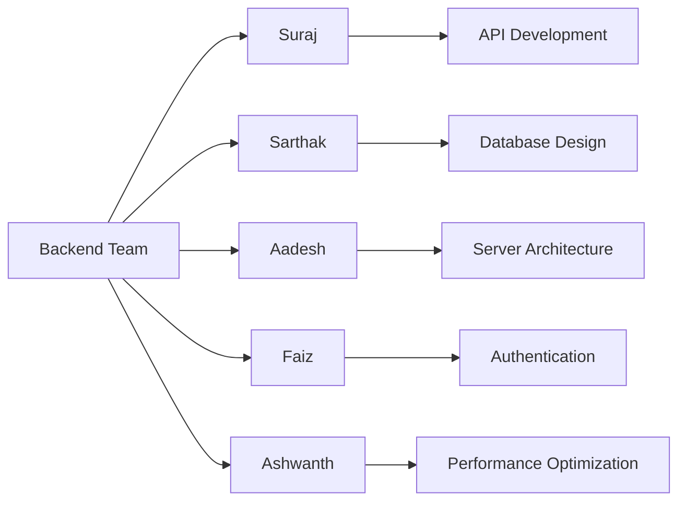
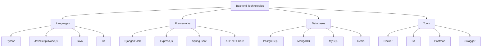
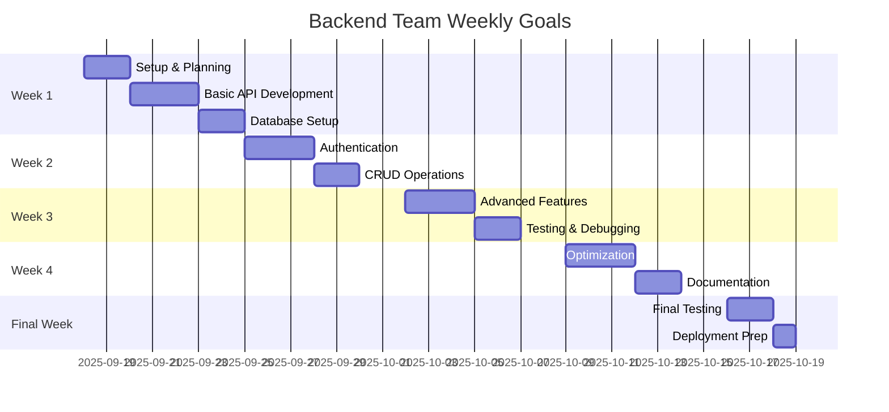

# Backend Team Documentation
*Nexoris Internship - September 18, 2025 to October 18, 2025*

## 👥 Team Members



## 🎯 Team Objectives
- Develop robust backend services and APIs
- Implement secure authentication and authorization
- Design and optimize database schemas
- Ensure high performance and scalability
- Maintain code quality and best practices

## 📁 Team Structure

```
backend-team/
├── README.md (this file)
├── suraj/
│   ├── README.md
│   ├── daily-reports/
│   ├── projects/
│   ├── code-snippets/
│   └── learning-notes/
├── sarthak/
│   ├── README.md
│   ├── daily-reports/
│   ├── projects/
│   ├── code-snippets/
│   └── learning-notes/
├── aadesh/
│   ├── README.md
│   ├── daily-reports/
│   ├── projects/
│   ├── code-snippets/
│   └── learning-notes/
├── faiz/
│   ├── README.md
│   ├── daily-reports/
│   ├── projects/
│   ├── code-snippets/
│   └── learning-notes/
└── ashwanth/
    ├── README.md
    ├── daily-reports/
    ├── projects/
    ├── code-snippets/
    └── learning-notes/
```

## 🔧 Technology Stack



## 📋 Daily Responsibilities

### Morning Standup (9:00 AM)
- Review previous day's progress
- Plan today's tasks
- Identify blockers
- Coordinate with team members

### Development Tasks
- Write clean, maintainable code
- Implement API endpoints
- Write unit tests
- Code reviews
- Documentation updates

### End of Day (6:00 PM)
- Update daily reports
- Commit code changes
- Document learnings
- Plan next day's tasks

## 📊 Progress Tracking



## 📝 Documentation Requirements

### Daily Reports Must Include:
1. **Tasks Completed**: List all tasks finished today
2. **Code Commits**: Links to commits and brief descriptions
3. **Challenges Faced**: Technical difficulties and solutions
4. **Learning Outcomes**: New concepts, tools, or techniques learned
5. **Time Tracking**: Hours spent on different activities
6. **Next Day Goals**: Planned tasks for tomorrow

### Weekly Summaries Must Include:
1. **Major Achievements**: Significant milestones reached
2. **Skills Developed**: New technical skills acquired
3. **Project Progress**: Overall project status
4. **Code Quality Metrics**: Lines of code, test coverage, etc.
5. **Collaboration Notes**: Team interactions and pair programming
6. **Next Week Focus**: Goals and priorities

## 🔗 Communication
- **Team Chat**: https://t.me/+Rxci8ibsCPUyYzZl
- **Daily Standups**: 9:00 AM via team chat
- **Code Reviews**: As needed via Git/GitHub
- **Emergency Contact**: Team lead via direct message

## ⚠️ Important Guidelines
1. **Code Quality**: Follow established coding standards
2. **Testing**: Write tests for all new features
3. **Documentation**: Document all APIs and functions
4. **Security**: Implement proper authentication and validation
5. **Performance**: Optimize for speed and scalability
6. **Individual Responsibility**: Each member updates only their own folder

## 🎓 Learning Goals
By the end of the internship, each backend team member should have:
- Proficiency in at least one backend framework
- Experience with database design and optimization
- Understanding of API development best practices
- Knowledge of authentication and security
- Experience with testing and debugging
- Professional development workflow skills

## 📈 Success Metrics
- **Code Quality**: 90%+ test coverage
- **Documentation**: Complete API documentation
- **Performance**: Sub-200ms response times
- **Security**: Zero critical vulnerabilities
- **Collaboration**: Active participation in code reviews

---
**Backend Team Lead**: [To be assigned]  
**Last Updated**: September 18, 2025
