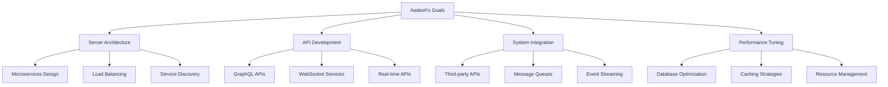

# Aadesh - Backend Developer
*Nexoris Internship - September 18, 2025 to October 18, 2025*

## 👤 Personal Information
- **Name**: Aadesh
- **Role**: Backend Developer
- **Team**: Backend Team
- **Start Date**: September 18, 2025
- **Duration**: 1 Month

## 🎯 Personal Objectives



## 📁 Personal Folder Structure

```
aadesh/
├── README.md (this file)
├── daily-reports/
├── projects/
├── code-snippets/
└── learning-notes/
```

## 📋 Daily Responsibilities
- Server architecture design and implementation
- API development and integration
- System performance optimization
- Third-party service integration
- Real-time feature development

## 🛠️ Technology Focus Areas
- **Backend**: Node.js, Python, Go
- **Architecture**: Microservices, Event-driven
- **Integration**: REST, GraphQL, WebSockets
- **Tools**: Docker, Redis, Message Queues

---
**Last Updated**: September 18, 2025
