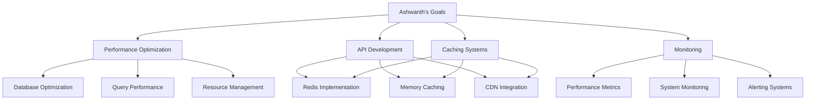

# Ashwanth - Backend Developer
*Nexoris Internship - September 18, 2025 to October 18, 2025*

## 👤 Personal Information
- **Name**: Ashwanth
- **Role**: Backend Developer
- **Team**: Backend Team
- **Start Date**: September 18, 2025
- **Duration**: 1 Month

## 🎯 Personal Objectives



## 📁 Personal Folder Structure

```
ashwanth/
├── README.md (this file)
├── daily-reports/
├── projects/
├── code-snippets/
└── learning-notes/
```

## 📋 Daily Responsibilities
- Performance optimization and tuning
- Caching system implementation
- API performance monitoring
- Database query optimization
- System resource management

## 🛠️ Technology Focus Areas
- **Performance**: Caching, Optimization, Profiling
- **Backend**: Node.js, Python, Go
- **Caching**: Redis, Memcached, CDN
- **Monitoring**: Prometheus, Grafana, APM tools

---
**Last Updated**: September 18, 2025
