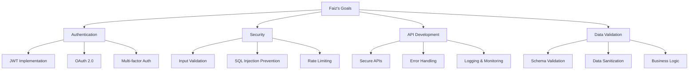

# Faiz - Backend Developer
*Nexoris Internship - September 18, 2025 to October 18, 2025*

## 👤 Personal Information
- **Name**: Faiz
- **Role**: Backend Developer
- **Team**: Backend Team
- **Start Date**: September 18, 2025
- **Duration**: 1 Month

## 🎯 Personal Objectives



## 📁 Personal Folder Structure

```
faiz/
├── README.md (this file)
├── daily-reports/
├── projects/
├── code-snippets/
└── learning-notes/
```

## 📋 Daily Responsibilities
- Authentication system development
- Security implementation and testing
- API security and validation
- Data validation and sanitization
- Security audit and compliance

## 🛠️ Technology Focus Areas
- **Security**: JWT, OAuth, Encryption
- **Backend**: Node.js, Python, Java
- **Validation**: Joi, Yup, Pydantic
- **Tools**: Security scanners, Testing tools

---
**Last Updated**: September 18, 2025
