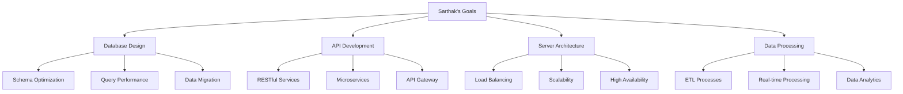

# Sarthak - Backend Developer
*Nexoris Internship - September 18, 2025 to October 18, 2025*

## 👤 Personal Information
- **Name**: Sarthak
- **Role**: Backend Developer
- **Team**: Backend Team
- **Start Date**: September 18, 2025
- **Duration**: 1 Month

## 🎯 Personal Objectives



## 📁 Personal Folder Structure

```
sarthak/
├── README.md (this file)
├── daily-reports/
├── projects/
├── code-snippets/
└── learning-notes/
```

## 📋 Daily Responsibilities
- Database schema design and optimization
- API endpoint development
- Server architecture planning
- Data processing pipeline development
- Performance monitoring and optimization

## 🛠️ Technology Focus Areas
- **Database**: PostgreSQL, MongoDB, Redis
- **Backend**: Node.js, Python, Java
- **Architecture**: Microservices, Event-driven
- **Tools**: Docker, Kubernetes, Git

## 📝 Documentation Standards
Follow the same daily report template as other team members with focus on database and architecture work.

---
**Last Updated**: September 18, 2025
