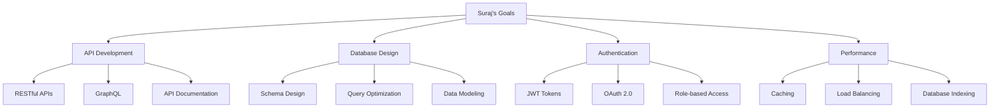
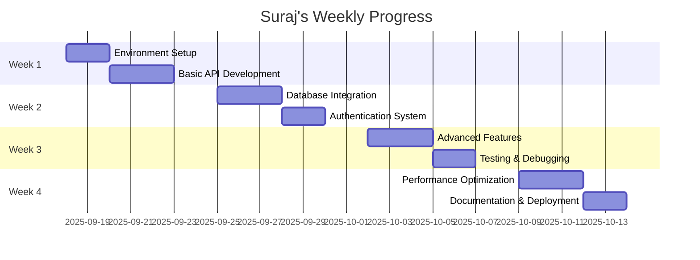

# Suraj - Backend Developer
*Nexoris Internship - September 18, 2025 to October 18, 2025*

## 👤 Personal Information
- **Name**: Suraj
- **Role**: Backend Developer
- **Team**: Backend Team
- **Start Date**: September 18, 2025
- **Duration**: 1 Month

## 🎯 Personal Objectives



## 📁 Personal Folder Structure

```
suraj/
├── README.md (this file)
├── daily-reports/
│   ├── 2025-09-18.md
│   ├── 2025-09-19.md
│   └── ... (daily reports)
├── projects/
│   ├── project-1/
│   ├── project-2/
│   └── ... (project documentation)
├── code-snippets/
│   ├── api-examples/
│   ├── database-queries/
│   └── authentication/
└── learning-notes/
    ├── technologies/
    ├── best-practices/
    └── tutorials/
```

## 📋 Daily Responsibilities

### Morning (9:00 AM - 12:00 PM)
- [ ] Review previous day's code
- [ ] Plan today's development tasks
- [ ] Attend team standup
- [ ] Start primary development task

### Afternoon (1:00 PM - 5:00 PM)
- [ ] Continue development work
- [ ] Code reviews and testing
- [ ] Documentation updates
- [ ] Collaborate with team members

### Evening (5:00 PM - 6:00 PM)
- [ ] Update daily report
- [ ] Commit code changes
- [ ] Plan next day's tasks
- [ ] Document learnings

## 📊 Weekly Goals



## 🛠️ Technology Focus Areas

### Primary Technologies:
- **Backend Framework**: [To be determined based on project]
- **Database**: PostgreSQL/MySQL
- **Authentication**: JWT, OAuth 2.0
- **API Design**: RESTful, GraphQL
- **Testing**: Unit tests, Integration tests

### Learning Goals:
- [ ] Master chosen backend framework
- [ ] Implement secure authentication
- [ ] Design efficient database schemas
- [ ] Write comprehensive tests
- [ ] Optimize API performance

## 📝 Documentation Standards

### Daily Report Template:
```markdown
# Daily Report - [Date]

## Tasks Completed
- [ ] Task 1
- [ ] Task 2
- [ ] Task 3

## Code Commits
- [Commit Hash]: Brief description

## Challenges Faced
- Challenge 1: Solution implemented
- Challenge 2: Solution implemented

## Learning Outcomes
- New concept 1
- New concept 2

## Time Tracking
- Development: X hours
- Testing: X hours
- Documentation: X hours
- Learning: X hours

## Next Day Goals
- [ ] Goal 1
- [ ] Goal 2
```

## 🎓 Skills Development Plan

### Week 1: Foundation
- [ ] Set up development environment
- [ ] Learn project requirements
- [ ] Understand codebase structure
- [ ] Implement basic CRUD operations

### Week 2: Core Development
- [ ] Build authentication system
- [ ] Design database schema
- [ ] Implement API endpoints
- [ ] Write unit tests

### Week 3: Advanced Features
- [ ] Add advanced functionality
- [ ] Implement caching
- [ ] Optimize database queries
- [ ] Integration testing

### Week 4: Polish & Deploy
- [ ] Performance optimization
- [ ] Security hardening
- [ ] Complete documentation
- [ ] Deployment preparation

## 📈 Success Metrics

### Technical Metrics:
- [ ] 90%+ test coverage
- [ ] < 200ms API response time
- [ ] Zero critical security vulnerabilities
- [ ] Complete API documentation

### Learning Metrics:
- [ ] Master 3+ new technologies
- [ ] Contribute to 5+ major features
- [ ] Complete 20+ daily reports
- [ ] Participate in all code reviews

## 🔗 Resources & Links

### Learning Resources:
- [Backend Development Best Practices](link)
- [API Design Guidelines](link)
- [Database Optimization](link)
- [Security Best Practices](link)

### Project Links:
- [Repository](link)
- [API Documentation](link)
- [Deployment Dashboard](link)
- [Testing Reports](link)

## 📞 Contact Information
- **Team Chat**: https://t.me/+Rxci8ibsCPUyYzZl
- **Email**: [To be provided]
- **GitHub**: [To be provided]

---
**Last Updated**: September 18, 2025  
**Next Review**: September 25, 2025
