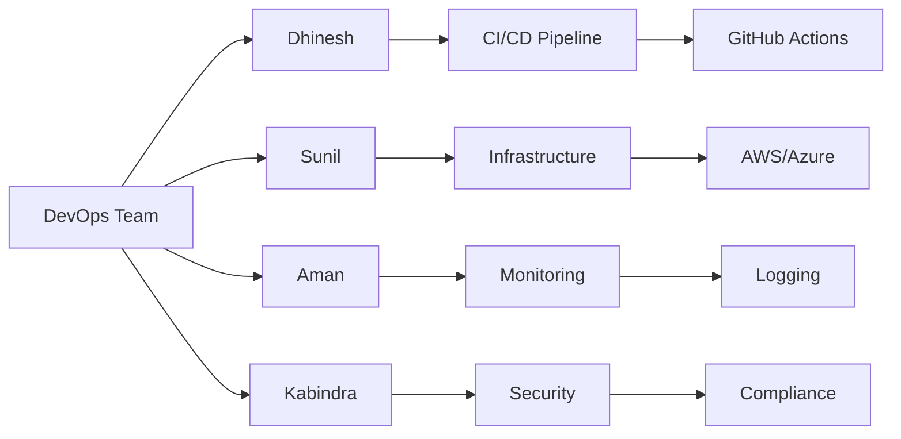
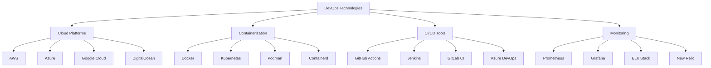
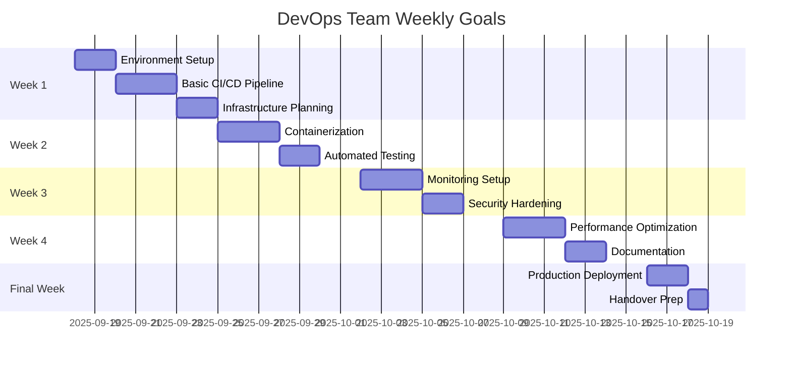
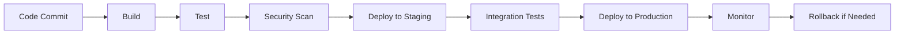

# DevOps Team Documentation
*Nexoris Internship - September 18, 2025 to October 18, 2025*

## 👥 Team Members



## 🎯 Team Objectives
- Automate deployment and infrastructure management
- Implement robust CI/CD pipelines
- Ensure system reliability and monitoring
- Maintain security and compliance standards
- Optimize performance and scalability

## 📁 Team Structure

```
devops-team/
├── README.md (this file)
├── dhinesh/
│   ├── README.md
│   ├── daily-reports/
│   ├── projects/
│   ├── pipelines/
│   └── infrastructure/
├── sunil/
│   ├── README.md
│   ├── daily-reports/
│   ├── projects/
│   ├── pipelines/
│   └── infrastructure/
├── aman/
│   ├── README.md
│   ├── daily-reports/
│   ├── projects/
│   ├── pipelines/
│   └── infrastructure/
└── kabindra/
    ├── README.md
    ├── daily-reports/
    ├── projects/
    ├── pipelines/
    └── infrastructure/
```

## 🛠️ Technology Stack



## 📋 Daily Responsibilities

### Morning Standup (9:00 AM)
- Review system health and alerts
- Plan infrastructure changes
- Coordinate with development teams
- Identify automation opportunities

### Development Tasks
- Build and maintain CI/CD pipelines
- Manage infrastructure as code
- Monitor system performance
- Implement security measures
- Automate deployment processes

### End of Day (6:00 PM)
- Update daily reports
- Review system metrics
- Document infrastructure changes
- Plan next day's automation tasks

## 📊 Progress Tracking



## 📝 Documentation Requirements

### Daily Reports Must Include:
1. **Infrastructure Changes**: Servers, networks, and configurations modified
2. **Pipeline Updates**: CI/CD pipeline improvements and fixes
3. **Monitoring Alerts**: System issues and resolutions
4. **Security Updates**: Security patches and compliance checks
5. **Automation Tasks**: Scripts and tools created/modified
6. **Deployment Activities**: Production and staging deployments
7. **Time Tracking**: Hours spent on different activities
8. **Next Day Goals**: Planned infrastructure and automation tasks

### Weekly Summaries Must Include:
1. **Major Infrastructure**: Significant system improvements
2. **Skills Developed**: New DevOps tools and technologies mastered
3. **Project Progress**: Overall infrastructure and automation status
4. **Performance Metrics**: System uptime, response times, resource usage
5. **Security Compliance**: Security audits and vulnerability assessments
6. **Collaboration Notes**: Coordination with development teams
7. **Next Week Focus**: Goals and infrastructure priorities

## 🔧 Infrastructure Management

### Environment Standards:
- **Development**: Local development environment setup
- **Staging**: Pre-production testing environment
- **Production**: Live production environment
- **Monitoring**: Comprehensive system monitoring
- **Backup**: Automated backup and recovery systems

### Security Practices:
- **Access Control**: Role-based access management
- **Encryption**: Data encryption at rest and in transit
- **Vulnerability Scanning**: Regular security assessments
- **Compliance**: Industry standard compliance (SOC 2, ISO 27001)
- **Incident Response**: Security incident handling procedures

## 🔗 Communication
- **Team Chat**: https://t.me/+qTMG049763NiOWY1
- **Daily Standups**: 9:00 AM via team chat
- **Infrastructure Reviews**: Weekly system health reviews
- **Development Coordination**: Regular sync with dev teams
- **Emergency Contact**: Team lead via direct message

## ⚠️ Important Guidelines
1. **Infrastructure as Code**: All infrastructure must be version controlled
2. **Security First**: Implement security measures from the start
3. **Monitoring**: Comprehensive monitoring and alerting systems
4. **Documentation**: Document all infrastructure and processes
5. **Automation**: Automate repetitive tasks and deployments
6. **Individual Responsibility**: Each member updates only their own folder

## 🎓 Learning Goals
By the end of the internship, each DevOps team member should have:
- Proficiency in cloud platforms and services
- Experience with containerization and orchestration
- Understanding of CI/CD pipeline development
- Knowledge of monitoring and logging systems
- Experience with infrastructure automation
- Professional DevOps workflow skills

## 📈 Success Metrics
- **Uptime**: 99.9%+ system availability
- **Deployment Speed**: < 5 minutes deployment time
- **Security**: Zero critical vulnerabilities
- **Automation**: 90%+ automated processes
- **Monitoring**: 100% system coverage

## 🚀 Deployment Pipeline



## 📊 Monitoring Dashboard
- **System Health**: CPU, Memory, Disk usage
- **Application Metrics**: Response times, error rates
- **Security Alerts**: Failed logins, suspicious activities
- **Deployment Status**: Success/failure rates
- **Cost Optimization**: Resource utilization and costs

---
**DevOps Team Lead**: [To be assigned]  
**Last Updated**: September 18, 2025
