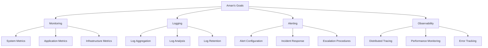

# Aman - DevOps Engineer
*Nexoris Internship - September 18, 2025 to October 18, 2025*

## 👤 Personal Information
- **Name**: Aman
- **Role**: DevOps Engineer
- **Team**: DevOps Team
- **Start Date**: September 18, 2025
- **Duration**: 1 Month

## 🎯 Personal Objectives



## 📁 Personal Folder Structure

```
aman/
├── README.md (this file)
├── daily-reports/
├── projects/
├── pipelines/
└── infrastructure/
```

## 📋 Daily Responsibilities
- System monitoring and observability
- Log management and analysis
- Alert configuration and incident response
- Performance monitoring and optimization
- Error tracking and debugging

## 🛠️ Technology Focus Areas
- **Monitoring**: Prometheus, Grafana, New Relic
- **Logging**: ELK Stack, Fluentd, Splunk
- **Observability**: Jaeger, Zipkin, OpenTelemetry
- **Alerting**: PagerDuty, Slack, Email notifications

---
**Last Updated**: September 18, 2025
