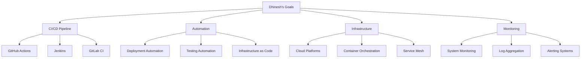

# Dhinesh - DevOps Engineer
*Nexoris Internship - September 18, 2025 to October 18, 2025*

## 👤 Personal Information
- **Name**: Dhinesh
- **Role**: DevOps Engineer
- **Team**: DevOps Team
- **Start Date**: September 18, 2025
- **Duration**: 1 Month

## 🎯 Personal Objectives



## 📁 Personal Folder Structure

```
dhinesh/
├── README.md (this file)
├── daily-reports/
├── projects/
├── pipelines/
└── infrastructure/
```

## 📋 Daily Responsibilities
- CI/CD pipeline development and maintenance
- Deployment automation
- Infrastructure provisioning
- System monitoring and alerting
- Performance optimization

## 🛠️ Technology Focus Areas
- **CI/CD**: GitHub Actions, Jenkins, GitLab CI
- **Cloud**: AWS, Azure, Google Cloud
- **Containers**: Docker, Kubernetes
- **Monitoring**: Prometheus, Grafana, ELK Stack

---
**Last Updated**: September 18, 2025
