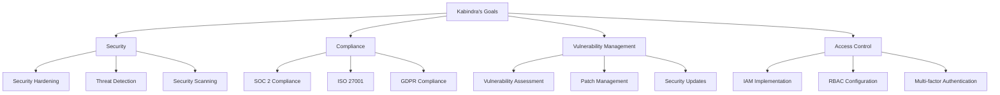

# Kabindra - DevOps Engineer
*Nexoris Internship - September 18, 2025 to October 18, 2025*

## 👤 Personal Information
- **Name**: Kabindra
- **Role**: DevOps Engineer
- **Team**: DevOps Team
- **Start Date**: September 18, 2025
- **Duration**: 1 Month

## 🎯 Personal Objectives



## 📁 Personal Folder Structure

```
kabindra/
├── README.md (this file)
├── daily-reports/
├── projects/
├── pipelines/
└── infrastructure/
```

## 📋 Daily Responsibilities
- Security implementation and hardening
- Compliance monitoring and reporting
- Vulnerability assessment and management
- Access control and identity management
- Security incident response

## 🛠️ Technology Focus Areas
- **Security**: Security scanners, WAF, SIEM
- **Compliance**: Audit tools, Compliance frameworks
- **Access Control**: IAM, RBAC, MFA
- **Monitoring**: Security monitoring, Threat detection

---
**Last Updated**: September 18, 2025
