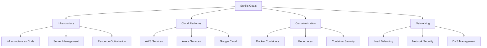

# Sunil - DevOps Engineer
*Nexoris Internship - September 18, 2025 to October 18, 2025*

## 👤 Personal Information
- **Name**: Sunil
- **Role**: DevOps Engineer
- **Team**: DevOps Team
- **Start Date**: September 18, 2025
- **Duration**: 1 Month

## 🎯 Personal Objectives



## 📁 Personal Folder Structure

```
sunil/
├── README.md (this file)
├── daily-reports/
├── projects/
├── pipelines/
└── infrastructure/
```

## 📋 Daily Responsibilities
- Infrastructure design and management
- Cloud platform configuration
- Container orchestration
- Network setup and security
- Resource optimization and scaling

## 🛠️ Technology Focus Areas
- **Infrastructure**: Terraform, CloudFormation
- **Cloud**: AWS, Azure, Google Cloud
- **Containers**: Docker, Kubernetes, Helm
- **Networking**: VPC, Load Balancers, CDN

---
**Last Updated**: September 18, 2025
