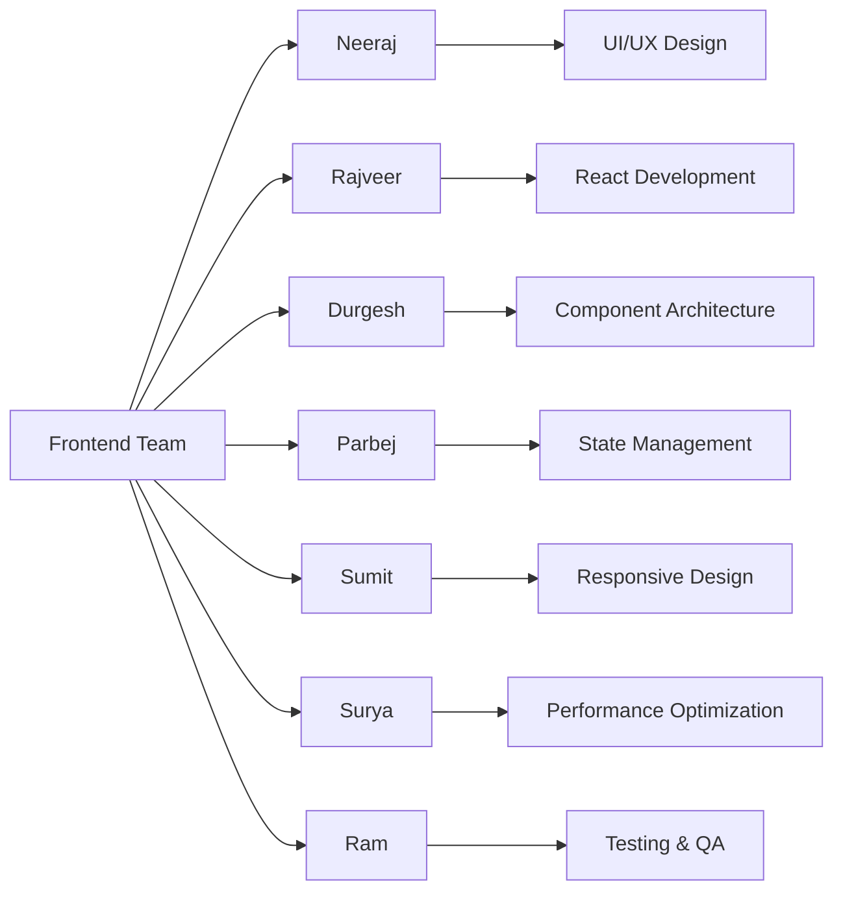
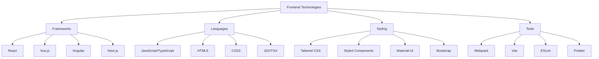
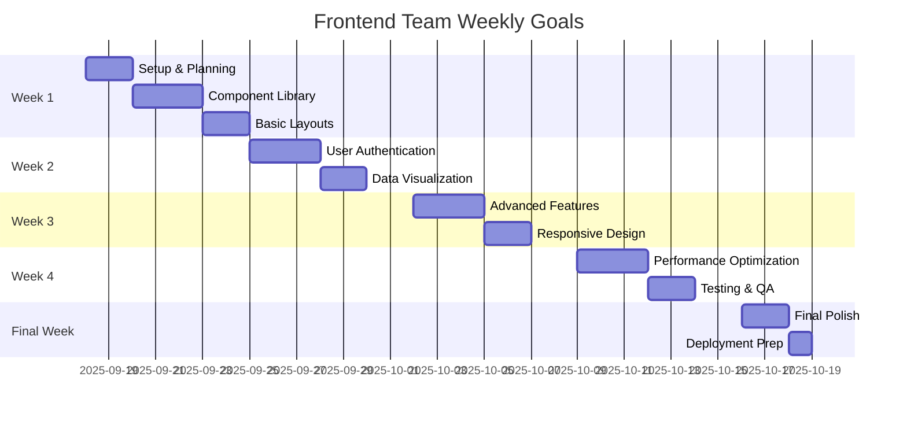

# Frontend Team Documentation
*Nexoris Internship - September 18, 2025 to October 18, 2025*

## 👥 Team Members



## 🎯 Team Objectives
- Create intuitive and responsive user interfaces
- Implement modern frontend frameworks and libraries
- Ensure cross-browser compatibility
- Optimize for performance and accessibility
- Maintain consistent design systems

## 📁 Team Structure

```
frontend-team/
├── README.md (this file)
├── neeraj/
│   ├── README.md
│   ├── daily-reports/
│   ├── projects/
│   ├── components/
│   └── design-assets/
├── rajveer/
│   ├── README.md
│   ├── daily-reports/
│   ├── projects/
│   ├── components/
│   └── design-assets/
├── durgesh/
│   ├── README.md
│   ├── daily-reports/
│   ├── projects/
│   ├── components/
│   └── design-assets/
├── parbej/
│   ├── README.md
│   ├── daily-reports/
│   ├── projects/
│   ├── components/
│   └── design-assets/
├── sumit/
│   ├── README.md
│   ├── daily-reports/
│   ├── projects/
│   ├── components/
│   └── design-assets/
├── surya/
│   ├── README.md
│   ├── daily-reports/
│   ├── projects/
│   ├── components/
│   └── design-assets/
└── ram/
    ├── README.md
    ├── daily-reports/
    ├── projects/
    ├── components/
    └── design-assets/
```

## 🎨 Technology Stack



## 📋 Daily Responsibilities

### Morning Standup (9:00 AM)
- Review design mockups and requirements
- Plan component development
- Coordinate with backend team
- Identify UI/UX improvements

### Development Tasks
- Build reusable components
- Implement responsive designs
- Write clean, maintainable code
- Conduct code reviews
- Update documentation

### End of Day (6:00 PM)
- Update daily reports
- Commit code changes
- Test cross-browser compatibility
- Document component usage

## 📊 Progress Tracking



## 📝 Documentation Requirements

### Daily Reports Must Include:
1. **Components Built**: List of components created/modified
2. **UI/UX Improvements**: Design changes and user experience enhancements
3. **Code Commits**: Links to commits with descriptions
4. **Testing Results**: Cross-browser testing and bug fixes
5. **Learning Outcomes**: New frameworks, libraries, or techniques
6. **Time Tracking**: Hours spent on different activities
7. **Next Day Goals**: Planned tasks and components

### Weekly Summaries Must Include:
1. **Major Features**: Significant UI/UX implementations
2. **Skills Developed**: New frontend technologies mastered
3. **Project Progress**: Overall frontend development status
4. **Performance Metrics**: Page load times, bundle sizes
5. **Accessibility**: WCAG compliance and improvements
6. **Collaboration Notes**: Backend integration and team coordination
7. **Next Week Focus**: Goals and design priorities

## 🎨 Design Guidelines

### Component Standards:
- **Reusability**: Build components that can be used across the application
- **Accessibility**: Follow WCAG 2.1 AA guidelines
- **Responsiveness**: Ensure mobile-first design approach
- **Performance**: Optimize for fast loading and smooth interactions
- **Consistency**: Maintain design system standards

### Code Quality:
- **TypeScript**: Use TypeScript for type safety
- **ESLint**: Follow established linting rules
- **Testing**: Write unit tests for components
- **Documentation**: Document component props and usage
- **Version Control**: Use semantic commit messages

## 🔗 Communication
- **Team Chat**: https://t.me/+VVSI6c5C3C5jZjI1
- **Daily Standups**: 9:00 AM via team chat
- **Design Reviews**: Weekly design feedback sessions
- **Backend Coordination**: Regular sync with backend team
- **Emergency Contact**: Team lead via direct message

## ⚠️ Important Guidelines
1. **Design Consistency**: Follow established design system
2. **Performance**: Optimize for Core Web Vitals
3. **Accessibility**: Ensure inclusive design practices
4. **Testing**: Test across multiple browsers and devices
5. **Documentation**: Document all components and their usage
6. **Individual Responsibility**: Each member updates only their own folder

## 🎓 Learning Goals
By the end of the internship, each frontend team member should have:
- Proficiency in modern frontend frameworks
- Experience with responsive design principles
- Understanding of accessibility best practices
- Knowledge of performance optimization techniques
- Experience with component-based architecture
- Professional development workflow skills

## 📈 Success Metrics
- **Performance**: 90+ Lighthouse score
- **Accessibility**: WCAG 2.1 AA compliance
- **Cross-browser**: 95%+ compatibility
- **Component Reusability**: 80%+ reusable components
- **Code Quality**: 90%+ test coverage

## 🖼️ Asset Management
- **Images**: Optimize and compress all images
- **Icons**: Use consistent icon library
- **Fonts**: Implement web-safe font loading
- **Colors**: Maintain brand color consistency
- **Spacing**: Follow 8px grid system

---
**Frontend Team Lead**: [To be assigned]  
**Last Updated**: September 18, 2025
