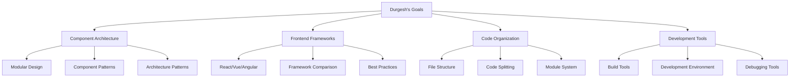

# Durgesh - Frontend Developer
*Nexoris Internship - September 18, 2025 to October 18, 2025*

## 👤 Personal Information
- **Name**: Durgesh
- **Role**: Frontend Developer
- **Team**: Frontend Team
- **Start Date**: September 18, 2025
- **Duration**: 1 Month

## 🎯 Personal Objectives



## 📁 Personal Folder Structure

```
durgesh/
├── README.md (this file)
├── daily-reports/
├── projects/
├── components/
└── design-assets/
```

## 📋 Daily Responsibilities
- Component architecture design
- Frontend framework implementation
- Code organization and structure
- Development tool configuration
- Technical documentation

## 🛠️ Technology Focus Areas
- **Architecture**: Component patterns, Design patterns
- **Frontend**: React, Vue.js, Angular
- **Tools**: Webpack, Vite, ESLint
- **Organization**: Monorepo, Micro-frontends

---
**Last Updated**: September 18, 2025
