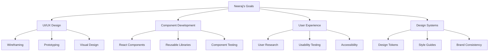

# Neeraj - Frontend Developer
*Nexoris Internship - September 18, 2025 to October 18, 2025*

## 👤 Personal Information
- **Name**: Neeraj
- **Role**: Frontend Developer
- **Team**: Frontend Team
- **Start Date**: September 18, 2025
- **Duration**: 1 Month

## 🎯 Personal Objectives



## 📁 Personal Folder Structure

```
neeraj/
├── README.md (this file)
├── daily-reports/
├── projects/
├── components/
└── design-assets/
```

## 📋 Daily Responsibilities
- UI/UX design and prototyping
- Component development and testing
- User experience optimization
- Design system maintenance
- Cross-browser compatibility testing

## 🛠️ Technology Focus Areas
- **Design**: Figma, Adobe XD, Sketch
- **Frontend**: React, TypeScript, CSS
- **Testing**: Jest, React Testing Library
- **Tools**: Storybook, Design Systems

---
**Last Updated**: September 18, 2025
