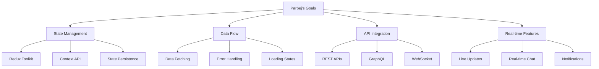

# Parbej - Frontend Developer
*Nexoris Internship - September 18, 2025 to October 18, 2025*

## 👤 Personal Information
- **Name**: Parbej
- **Role**: Frontend Developer
- **Team**: Frontend Team
- **Start Date**: September 18, 2025
- **Duration**: 1 Month

## 🎯 Personal Objectives



## 📁 Personal Folder Structure

```
parbej/
├── README.md (this file)
├── daily-reports/
├── projects/
├── components/
└── design-assets/
```

## 📋 Daily Responsibilities
- State management implementation
- API integration and data flow
- Real-time feature development
- Data persistence and caching
- Error handling and loading states

## 🛠️ Technology Focus Areas
- **State**: Redux, Zustand, Context API
- **Data**: REST, GraphQL, WebSocket
- **Frontend**: React, TypeScript
- **Tools**: React Query, SWR, Axios

---
**Last Updated**: September 18, 2025
