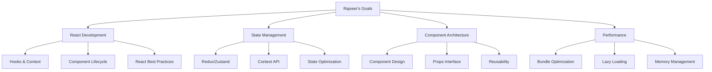

# Rajveer - Frontend Developer
*Nexoris Internship - September 18, 2025 to October 18, 2025*

## 👤 Personal Information
- **Name**: Rajveer
- **Role**: Frontend Developer
- **Team**: Frontend Team
- **Start Date**: September 18, 2025
- **Duration**: 1 Month

## 🎯 Personal Objectives



## 📁 Personal Folder Structure

```
rajveer/
├── README.md (this file)
├── daily-reports/
├── projects/
├── components/
└── design-assets/
```

## 📋 Daily Responsibilities
- React application development
- State management implementation
- Component architecture design
- Performance optimization
- Code quality maintenance

## 🛠️ Technology Focus Areas
- **Frontend**: React, TypeScript, JavaScript
- **State**: Redux, Zustand, Context API
- **Tools**: Webpack, Vite, ESLint
- **Testing**: Jest, React Testing Library

---
**Last Updated**: September 18, 2025
