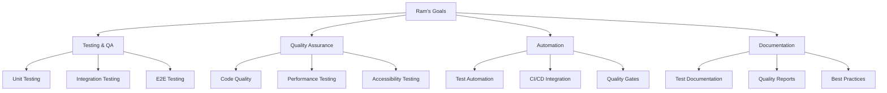

# Ram - Frontend Developer
*Nexoris Internship - September 18, 2025 to October 18, 2025*

## 👤 Personal Information
- **Name**: Ram
- **Role**: Frontend Developer
- **Team**: Frontend Team
- **Start Date**: September 18, 2025
- **Duration**: 1 Month

## 🎯 Personal Objectives



## 📁 Personal Folder Structure

```
ram/
├── README.md (this file)
├── daily-reports/
├── projects/
├── components/
└── design-assets/
```

## 📋 Daily Responsibilities
- Frontend testing implementation
- Quality assurance processes
- Test automation setup
- Code quality monitoring
- Testing documentation

## 🛠️ Technology Focus Areas
- **Testing**: Jest, Cypress, Playwright
- **Quality**: ESLint, Prettier, SonarQube
- **Automation**: GitHub Actions, CI/CD
- **Documentation**: Testing guides, Quality reports

---
**Last Updated**: September 18, 2025
