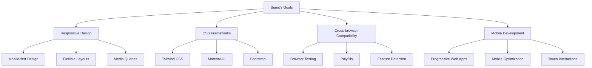

# Sumit - Frontend Developer
*Nexoris Internship - September 18, 2025 to October 18, 2025*

## 👤 Personal Information
- **Name**: Sumit
- **Role**: Frontend Developer
- **Team**: Frontend Team
- **Start Date**: September 18, 2025
- **Duration**: 1 Month

## 🎯 Personal Objectives



## 📁 Personal Folder Structure

```
sumit/
├── README.md (this file)
├── daily-reports/
├── projects/
├── components/
└── design-assets/
```

## 📋 Daily Responsibilities
- Responsive design implementation
- CSS framework integration
- Cross-browser compatibility testing
- Mobile optimization
- Progressive Web App development

## 🛠️ Technology Focus Areas
- **Styling**: CSS3, Tailwind, Material-UI
- **Responsive**: Flexbox, Grid, Media Queries
- **Mobile**: PWA, Touch Events, Mobile APIs
- **Testing**: Browser Testing, Device Testing

---
**Last Updated**: September 18, 2025
