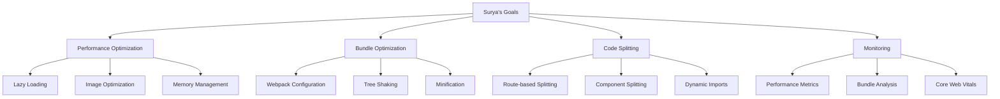

# Surya - Frontend Developer
*Nexoris Internship - September 18, 2025 to October 18, 2025*

## 👤 Personal Information
- **Name**: Surya
- **Role**: Frontend Developer
- **Team**: Frontend Team
- **Start Date**: September 18, 2025
- **Duration**: 1 Month

## 🎯 Personal Objectives



## 📁 Personal Folder Structure

```
surya/
├── README.md (this file)
├── daily-reports/
├── projects/
├── components/
└── design-assets/
```

## 📋 Daily Responsibilities
- Frontend performance optimization
- Bundle size optimization
- Code splitting implementation
- Performance monitoring
- Core Web Vitals optimization

## 🛠️ Technology Focus Areas
- **Performance**: Webpack, Vite, Bundle Analysis
- **Optimization**: Lazy Loading, Tree Shaking
- **Monitoring**: Lighthouse, Web Vitals
- **Tools**: Bundle Analyzer, Performance Profiler

---
**Last Updated**: September 18, 2025
