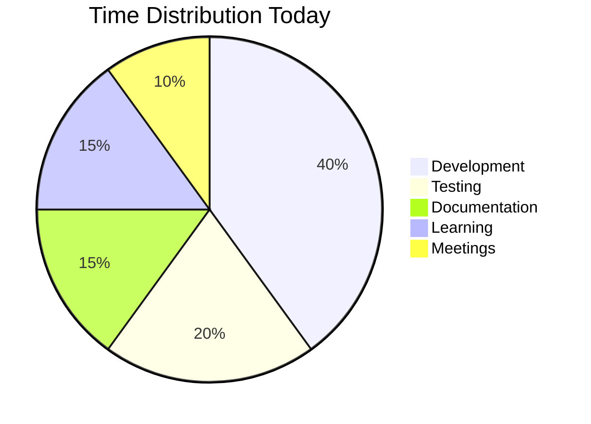

# Daily Report Template
*Use this template for your daily reports*

## 📅 Daily Report - [Date: YYYY-MM-DD]
**Team**: [Backend/Frontend/DevOps]  
**Developer**: [Your Name]  
**Day**: [Day X of 30]

---

## ✅ Tasks Completed Today

### Primary Tasks
- [ ] **Task 1**: Brief description of what was accomplished
- [ ] **Task 2**: Brief description of what was accomplished
- [ ] **Task 3**: Brief description of what was accomplished

### Secondary Tasks
- [ ] **Task 4**: Brief description of what was accomplished
- [ ] **Task 5**: Brief description of what was accomplished

---

## 💻 Code Commits & Contributions

### Git Commits
- **[Commit Hash]**: Brief description of changes
  - Files modified: `file1.js`, `file2.css`
  - Lines added/removed: +50/-10
  - Purpose: What this commit accomplishes

- **[Commit Hash]**: Brief description of changes
  - Files modified: `file3.js`
  - Lines added/removed: +25/-5
  - Purpose: What this commit accomplishes

### Pull Requests
- **[PR #123]**: Title of pull request
  - Status: Open/In Review/Merged
  - Description: Brief summary of changes
  - Reviewers: @username1, @username2

---

## 🚧 Challenges Faced & Solutions

### Technical Challenges
1. **Challenge**: Description of the technical problem
   - **Solution**: How you solved it
   - **Learning**: What you learned from this experience
   - **Time Spent**: X hours

2. **Challenge**: Description of another challenge
   - **Solution**: How you solved it
   - **Learning**: What you learned
   - **Time Spent**: X hours

### Non-Technical Challenges
1. **Challenge**: Description of non-technical issue
   - **Solution**: How you resolved it
   - **Learning**: What you learned

---

## 📚 Learning Outcomes

### New Technologies/Tools
- **Technology 1**: What you learned and how you used it
- **Technology 2**: What you learned and how you used it
- **Tool 1**: New tool you discovered and its benefits

### Skills Developed
- **Skill 1**: How you improved in this area
- **Skill 2**: New skill you developed
- **Best Practice**: New best practice you learned

### Resources Used
- **Documentation**: Links to helpful documentation
- **Tutorials**: Links to tutorials or courses
- **Articles**: Links to helpful articles or blog posts

---

## ⏱️ Time Tracking

### Time Allocation
- **Development**: X hours (XX%)
- **Testing**: X hours (XX%)
- **Documentation**: X hours (XX%)
- **Learning**: X hours (XX%)
- **Meetings**: X hours (XX%)
- **Debugging**: X hours (XX%)

### Productivity Metrics
- **Lines of Code**: +XXX/-XX
- **Files Modified**: XX files
- **Tests Written**: XX tests
- **Bugs Fixed**: XX bugs

---

## 🎯 Tomorrow's Goals

### Primary Goals
- [ ] **Goal 1**: Specific task you plan to work on
- [ ] **Goal 2**: Another specific task
- [ ] **Goal 3**: Third priority task

### Secondary Goals
- [ ] **Goal 4**: Lower priority task
- [ ] **Goal 5**: Another lower priority task

### Learning Goals
- [ ] **Learning Goal 1**: What you want to learn tomorrow
- [ ] **Learning Goal 2**: Another learning objective

---

## 📊 Progress Visualization

---

## 🔗 Links & References

### Project Links
- **Repository**: [Link to main repository]
- **Deployment**: [Link to deployed application]
- **Documentation**: [Link to project documentation]

### External Resources
- **Stack Overflow**: [Link to helpful answers]
- **GitHub Issues**: [Link to relevant issues]
- **Documentation**: [Link to official docs]

---

## 📝 Notes & Observations

### General Notes
- Any additional observations about the day
- Interesting discoveries or insights
- Team collaboration notes

### Questions for Tomorrow
- Questions you need to ask team members
- Clarifications needed from mentors
- Technical questions to research

---

## 🏆 Achievements

### Today's Wins
- **Achievement 1**: What you're proud of accomplishing
- **Achievement 2**: Another success from today
- **Achievement 3**: Third notable achievement

### Milestones Reached
- **Milestone 1**: Any project milestones reached
- **Milestone 2**: Personal learning milestones

---

**Report Generated**: [Timestamp]  
**Next Report Due**: [Next Day]  
**Team Lead Review**: [Status]

---

## 📋 Checklist

Before submitting your daily report, ensure you have:

- [ ] Completed all required sections
- [ ] Added proper commit links
- [ ] Documented all challenges and solutions
- [ ] Included time tracking information
- [ ] Set clear goals for tomorrow
- [ ] Added relevant links and references
- [ ] Proofread for clarity and completeness

---

*Remember: This report is monitored for accountability. Be thorough and honest in your documentation.*
