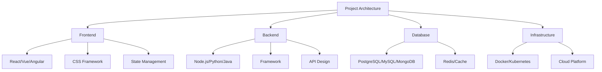
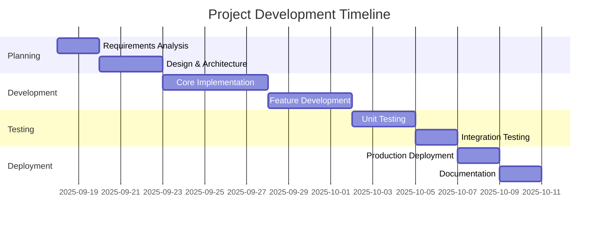

# Project Documentation Template
*Use this template for documenting your projects and features*

## 📋 Project Overview

### Project Information
- **Project Name**: [Name of the project/feature]
- **Developer**: [Your Name]
- **Team**: [Backend/Frontend/DevOps]
- **Start Date**: [YYYY-MM-DD]
- **End Date**: [YYYY-MM-DD]
- **Status**: [In Progress/Completed/On Hold]

### Project Description
Brief description of what this project/feature does and its purpose.

### Project Goals
- **Primary Goal**: Main objective of the project
- **Secondary Goals**: Additional objectives
- **Success Criteria**: How success will be measured

---

## 🎯 Technical Specifications

### Technology Stack


### Architecture Overview
- **System Architecture**: High-level system design
- **Data Flow**: How data flows through the system
- **API Endpoints**: List of API endpoints (if applicable)
- **Database Schema**: Database design and relationships

### Dependencies
- **External Libraries**: List of third-party libraries used
- **Internal Dependencies**: Dependencies on other team members' work
- **System Requirements**: Hardware/software requirements

---

## 💻 Implementation Details

### Core Features
1. **Feature 1**
   - **Description**: What this feature does
   - **Implementation**: How it's implemented
   - **Files**: List of files involved
   - **Complexity**: High/Medium/Low

2. **Feature 2**
   - **Description**: What this feature does
   - **Implementation**: How it's implemented
   - **Files**: List of files involved
   - **Complexity**: High/Medium/Low

3. **Feature 3**
   - **Description**: What this feature does
   - **Implementation**: How it's implemented
   - **Files**: List of files involved
   - **Complexity**: High/Medium/Low

### Code Structure
```
project-name/
├── src/
│   ├── components/
│   ├── services/
│   ├── utils/
│   └── tests/
├── docs/
├── config/
└── README.md
```

### Key Files
- **File 1**: Purpose and key functions
- **File 2**: Purpose and key functions
- **File 3**: Purpose and key functions

---

## 🔧 Development Process

### Development Timeline


### Development Phases
1. **Planning Phase**
   - Requirements gathering
   - Technical design
   - Architecture planning
   - Timeline estimation

2. **Development Phase**
   - Core implementation
   - Feature development
   - Code reviews
   - Testing

3. **Testing Phase**
   - Unit testing
   - Integration testing
   - User acceptance testing
   - Performance testing

4. **Deployment Phase**
   - Production deployment
   - Monitoring setup
   - Documentation
   - Handover

---

## 🧪 Testing Strategy

### Testing Approach
- **Unit Tests**: Testing individual components
- **Integration Tests**: Testing component interactions
- **End-to-End Tests**: Testing complete user workflows
- **Performance Tests**: Testing system performance

### Test Coverage
- **Code Coverage**: XX% of code covered by tests
- **Feature Coverage**: XX% of features tested
- **Critical Path Coverage**: XX% of critical paths tested

### Test Cases
1. **Test Case 1**
   - **Description**: What this test verifies
   - **Input**: Test input data
   - **Expected Output**: Expected result
   - **Status**: Pass/Fail

2. **Test Case 2**
   - **Description**: What this test verifies
   - **Input**: Test input data
   - **Expected Output**: Expected result
   - **Status**: Pass/Fail

### Testing Tools
- **Unit Testing**: Jest, Mocha, Pytest
- **Integration Testing**: Supertest, Postman
- **E2E Testing**: Cypress, Playwright
- **Performance Testing**: LoadRunner, JMeter

---

## 📊 Performance Metrics

### Performance Benchmarks
- **Response Time**: < 200ms average
- **Throughput**: XX requests per second
- **Memory Usage**: XX MB average
- **CPU Usage**: XX% average

### Optimization Strategies
- **Caching**: Redis/Memcached implementation
- **Database Optimization**: Query optimization, indexing
- **Code Optimization**: Algorithm improvements
- **Resource Optimization**: Memory and CPU optimization

### Monitoring
- **Metrics Tracked**: List of metrics being monitored
- **Alerting**: Alert conditions and thresholds
- **Dashboards**: Links to monitoring dashboards

---

## 🔒 Security Considerations

### Security Measures
- **Authentication**: How user authentication is handled
- **Authorization**: How user permissions are managed
- **Data Encryption**: How sensitive data is encrypted
- **Input Validation**: How user input is validated

### Security Testing
- **Vulnerability Scanning**: Results of security scans
- **Penetration Testing**: Results of pen tests
- **Code Review**: Security-focused code reviews
- **Compliance**: Compliance with security standards

### Security Best Practices
- **Secure Coding**: Secure coding practices followed
- **Dependency Management**: How dependencies are managed
- **Secrets Management**: How secrets are handled
- **Audit Logging**: What activities are logged

---

## 🚀 Deployment

### Deployment Strategy
- **Environment**: Development, Staging, Production
- **Deployment Method**: Manual, Automated, CI/CD
- **Rollback Plan**: How to rollback if issues occur
- **Zero Downtime**: How zero downtime is achieved

### Infrastructure Requirements
- **Server Specifications**: CPU, RAM, Storage requirements
- **Network Requirements**: Bandwidth, latency requirements
- **Database Requirements**: Database size, performance requirements
- **Third-party Services**: External services required

### Deployment Checklist
- [ ] Code reviewed and approved
- [ ] Tests passing
- [ ] Security scan completed
- [ ] Performance tests passed
- [ ] Documentation updated
- [ ] Monitoring configured
- [ ] Rollback plan ready

---

## 📚 Documentation

### User Documentation
- **User Guide**: How end users will use the feature
- **API Documentation**: API endpoints and usage
- **Installation Guide**: How to install and setup
- **Configuration Guide**: How to configure the system

### Developer Documentation
- **Code Documentation**: Inline code comments
- **Architecture Documentation**: System architecture
- **Development Guide**: How to contribute to the project
- **Troubleshooting Guide**: Common issues and solutions

### Maintenance Documentation
- **Monitoring Guide**: How to monitor the system
- **Backup Procedures**: How to backup data
- **Update Procedures**: How to update the system
- **Disaster Recovery**: Recovery procedures

---

## 🔗 Resources & References

### External Resources
- **Documentation**: Links to relevant documentation
- **Tutorials**: Links to helpful tutorials
- **Articles**: Links to useful articles
- **Stack Overflow**: Links to helpful answers

### Internal Resources
- **Repository**: Link to project repository
- **Issues**: Link to project issues
- **Wiki**: Link to project wiki
- **Slack Channel**: Link to project communication

### Tools & Services
- **Development Tools**: List of development tools used
- **Testing Tools**: List of testing tools used
- **Deployment Tools**: List of deployment tools used
- **Monitoring Tools**: List of monitoring tools used

---

## 📈 Lessons Learned

### What Went Well
- **Success 1**: What worked well in this project
- **Success 2**: Another positive aspect
- **Success 3**: Third success to highlight

### What Could Be Improved
- **Improvement 1**: Area for improvement
- **Improvement 2**: Another area to work on
- **Improvement 3**: Third improvement area

### Technical Lessons
- **Lesson 1**: Technical insight gained
- **Lesson 2**: Another technical lesson
- **Lesson 3**: Third technical lesson

### Process Lessons
- **Process 1**: Process improvement insight
- **Process 2**: Another process lesson
- **Process 3**: Third process lesson

---

## 🎯 Future Enhancements

### Planned Features
- **Feature 1**: Description of planned feature
- **Feature 2**: Description of another planned feature
- **Feature 3**: Description of third planned feature

### Technical Improvements
- **Improvement 1**: Technical enhancement planned
- **Improvement 2**: Another technical improvement
- **Improvement 3**: Third technical improvement

### Scalability Considerations
- **Current Limitations**: Current system limitations
- **Scaling Strategy**: How the system will scale
- **Performance Targets**: Future performance goals

---

## 📋 Project Checklist

### Development Checklist
- [ ] Requirements clearly defined
- [ ] Architecture designed and documented
- [ ] Code implemented and tested
- [ ] Security measures implemented
- [ ] Performance optimized
- [ ] Documentation completed

### Deployment Checklist
- [ ] Code reviewed and approved
- [ ] Tests passing
- [ ] Security scan completed
- [ ] Performance tests passed
- [ ] Monitoring configured
- [ ] Documentation updated

### Post-Deployment Checklist
- [ ] System monitoring active
- [ ] Performance metrics tracked
- [ ] User feedback collected
- [ ] Issues tracked and resolved
- [ ] Documentation maintained

---

**Project Documentation Generated**: [Timestamp]  
**Last Updated**: [Date]  
**Next Review**: [Date]

---

*Remember: This documentation is monitored for quality and completeness. Keep it updated as the project evolves.*
