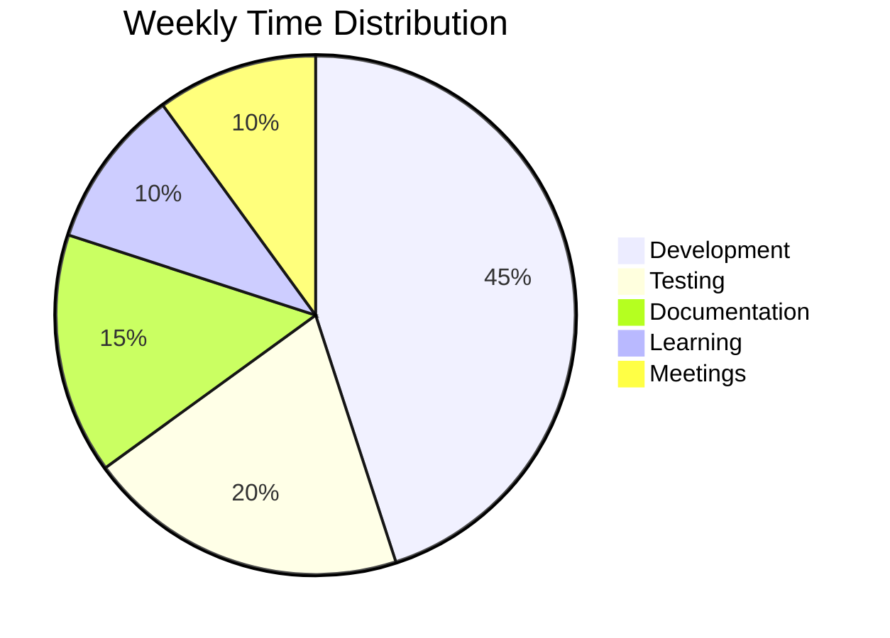

# Weekly Summary Template
*Use this template for your weekly summaries*

## 📅 Weekly Summary - Week [X] of 4
**Team**: [Backend/Frontend/DevOps]  
**Developer**: [Your Name]  
**Week**: [Start Date] to [End Date]  
**Days Worked**: [X] days

---

## 🎯 Week Overview

### Week Goals (From Previous Week)
- [ ] **Goal 1**: Status - Completed/In Progress/Not Started
- [ ] **Goal 2**: Status - Completed/In Progress/Not Started
- [ ] **Goal 3**: Status - Completed/In Progress/Not Started

### Week Achievements
- **Major Achievement 1**: Description of significant accomplishment
- **Major Achievement 2**: Description of another major accomplishment
- **Major Achievement 3**: Description of third major accomplishment

---

## 📊 Weekly Statistics

### Development Metrics
- **Total Commits**: XX commits
- **Lines of Code**: +XXX/-XX lines
- **Files Modified**: XX files
- **Pull Requests**: XX PRs (XX merged, XX in review)
- **Issues Resolved**: XX issues
- **Bugs Fixed**: XX bugs

### Time Distribution

### Productivity Trends
- **Most Productive Day**: [Day] - [Reason]
- **Most Challenging Day**: [Day] - [Reason]
- **Average Daily Hours**: X hours
- **Total Weekly Hours**: XX hours

---

## 🚀 Major Accomplishments

### Technical Achievements
1. **Feature/Component 1**
   - **Description**: What you built/implemented
   - **Technologies Used**: List of technologies
   - **Impact**: How it benefits the project
   - **Time Invested**: X hours

2. **Feature/Component 2**
   - **Description**: What you built/implemented
   - **Technologies Used**: List of technologies
   - **Impact**: How it benefits the project
   - **Time Invested**: X hours

3. **Feature/Component 3**
   - **Description**: What you built/implemented
   - **Technologies Used**: List of technologies
   - **Impact**: How it benefits the project
   - **Time Invested**: X hours

### Learning Achievements
1. **New Technology Mastered**
   - **Technology**: Name of technology
   - **Learning Method**: How you learned it
   - **Application**: How you used it in the project
   - **Confidence Level**: 1-10

2. **Skill Development**
   - **Skill**: Name of skill
   - **Improvement**: How you improved
   - **Evidence**: Examples of improved work
   - **Next Steps**: How to continue improving

---

## 🎓 Skills Development

### Technical Skills
- **Skill 1**: Progress made and current level
- **Skill 2**: Progress made and current level
- **Skill 3**: Progress made and current level

### Soft Skills
- **Communication**: How you improved team communication
- **Problem Solving**: Examples of complex problems solved
- **Time Management**: How you managed your time effectively
- **Collaboration**: Teamwork examples and improvements

### New Technologies Learned
- **Technology 1**: What you learned and how you applied it
- **Technology 2**: What you learned and how you applied it
- **Technology 3**: What you learned and how you applied it

---

## 🚧 Challenges & Solutions

### Technical Challenges
1. **Challenge**: Description of major technical challenge
   - **Impact**: How it affected your work
   - **Solution**: How you solved it
   - **Learning**: What you learned from this experience
   - **Prevention**: How to avoid similar issues

2. **Challenge**: Description of another challenge
   - **Impact**: How it affected your work
   - **Solution**: How you solved it
   - **Learning**: What you learned
   - **Prevention**: How to avoid similar issues

### Process Challenges
1. **Challenge**: Description of process-related challenge
   - **Impact**: How it affected your workflow
   - **Solution**: How you addressed it
   - **Improvement**: Suggested process improvements

---

## 📈 Project Progress

### Overall Project Status
- **Project Completion**: XX% complete
- **Sprint Goals**: XX% of sprint goals achieved
- **Timeline**: On track/Behind/Ahead of schedule

### Team Collaboration
- **Code Reviews**: XX reviews completed
- **Pair Programming**: X hours of pair programming
- **Knowledge Sharing**: Examples of knowledge shared
- **Mentoring**: Examples of helping team members

### Quality Metrics
- **Test Coverage**: XX% test coverage
- **Code Quality**: Improvements made
- **Documentation**: Documentation updates
- **Performance**: Performance improvements

---

## 📚 Learning & Development

### Resources Utilized
- **Online Courses**: Courses completed or in progress
- **Documentation**: Key documentation studied
- **Tutorials**: Tutorials completed
- **Books/Articles**: Reading materials

### Knowledge Gaps Identified
- **Gap 1**: Area where you need more knowledge
- **Gap 2**: Another area for improvement
- **Gap 3**: Third area to focus on

### Learning Plan for Next Week
- **Focus Area 1**: What you want to learn
- **Focus Area 2**: Another learning goal
- **Resources**: How you plan to learn

---

## 🎯 Next Week Goals

### Primary Goals
- [ ] **Goal 1**: Specific, measurable goal
- [ ] **Goal 2**: Another specific goal
- [ ] **Goal 3**: Third priority goal

### Secondary Goals
- [ ] **Goal 4**: Lower priority goal
- [ ] **Goal 5**: Another secondary goal

### Learning Goals
- [ ] **Learning Goal 1**: What you want to learn
- [ ] **Learning Goal 2**: Another learning objective

### Collaboration Goals
- [ ] **Team Goal 1**: How you'll help the team
- [ ] **Team Goal 2**: Another team contribution

---

## 📊 Weekly Reflection

### What Went Well
- **Success 1**: What worked well this week
- **Success 2**: Another positive aspect
- **Success 3**: Third success to highlight

### What Could Be Improved
- **Improvement 1**: Area for improvement
- **Improvement 2**: Another area to work on
- **Improvement 3**: Third improvement area

### Lessons Learned
- **Lesson 1**: Key takeaway from the week
- **Lesson 2**: Another important lesson
- **Lesson 3**: Third lesson learned

---

## 🔗 Important Links

### Project Resources
- **Repository**: [Link to main repository]
- **Documentation**: [Link to project docs]
- **Deployment**: [Link to deployed application]
- **Issues**: [Link to project issues]

### Learning Resources
- **Courses**: [Links to courses taken]
- **Documentation**: [Links to helpful docs]
- **Articles**: [Links to useful articles]

---

## 📝 Additional Notes

### General Observations
- Any additional thoughts about the week
- Interesting discoveries or insights
- Team dynamics observations

### Questions for Next Week
- Questions for team members
- Clarifications needed from mentors
- Technical questions to research

### Suggestions
- Process improvement suggestions
- Tool recommendations
- Workflow optimizations

---

## 🏆 Weekly Highlights

### Personal Highlights
- **Highlight 1**: Personal achievement you're proud of
- **Highlight 2**: Another personal success
- **Highlight 3**: Third personal highlight

### Team Highlights
- **Team Achievement 1**: Team success you contributed to
- **Team Achievement 2**: Another team accomplishment

---

## 📋 Weekly Checklist

Before submitting your weekly summary, ensure you have:

- [ ] Completed all required sections
- [ ] Added accurate statistics and metrics
- [ ] Documented all major accomplishments
- [ ] Identified challenges and solutions
- [ ] Set clear goals for next week
- [ ] Included relevant links and resources
- [ ] Reflected on the week's experiences
- [ ] Proofread for clarity and completeness

---

**Summary Generated**: [Timestamp]  
**Next Summary Due**: [Next Week Date]  
**Team Lead Review**: [Status]

---

*Remember: This weekly summary is monitored for accountability and progress tracking. Be comprehensive and honest in your documentation.*
